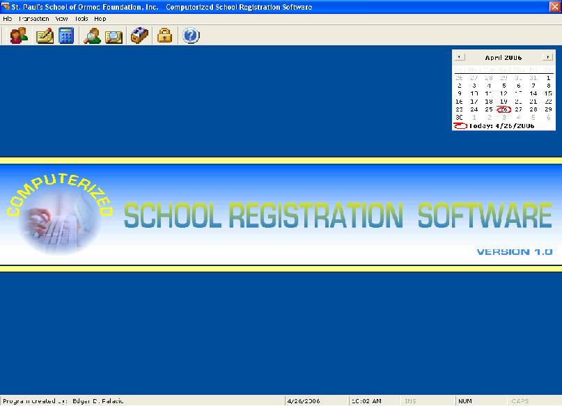



## SPS\-CSRS

### Description

This is COMPUTERIZED SCHOOL REGISTRATION SYSTEM. It accepts new enrollees, accepts payments and generate reports. I used Access for my database, ODBC and Excel for the reports. This system will monitor the payments of each student from their first payments to their balance. I include brief personal info of the teacher because that is needed in sectioning. The original plan is to automatically assign the students to a certain section based on their general average but the school change their sectioning system. I'm currently working on this project, comments and suggestions are very much welcom.
 
### More Info
 

             |
---                |---
**Submitted On**   |2006-04-25 21:45:10
**By**             |[Edgar D\. Palacio](https://github.com/Planet-Source-Code/PSCIndex/blob/master/ByAuthor/edgar-d-palacio.md)
**Level**          |Advanced
**User Rating**    |4.8 (38 globes from 8 users)
**Compatibility**  |VB 3\.0, VB 4\.0 \(16\-bit\), VB 4\.0 \(32\-bit\), VB 5\.0, VB 6\.0, VB Script, VBA MS Excel
**Category**       |[Complete Applications](https://github.com/Planet-Source-Code/PSCIndex/blob/master/ByCategory/complete-applications__1-27.md)
**World**          |[Visual Basic](https://github.com/Planet-Source-Code/PSCIndex/blob/master/ByWorld/visual-basic.md)
**Archive File**   |[SPS\-CSRS1989874252006\.zip](https://github.com/Planet-Source-Code/edgar-d-palacio-sps-csrs__1-65114/archive/master.zip)

